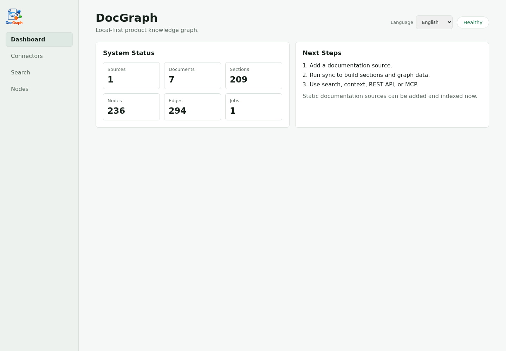
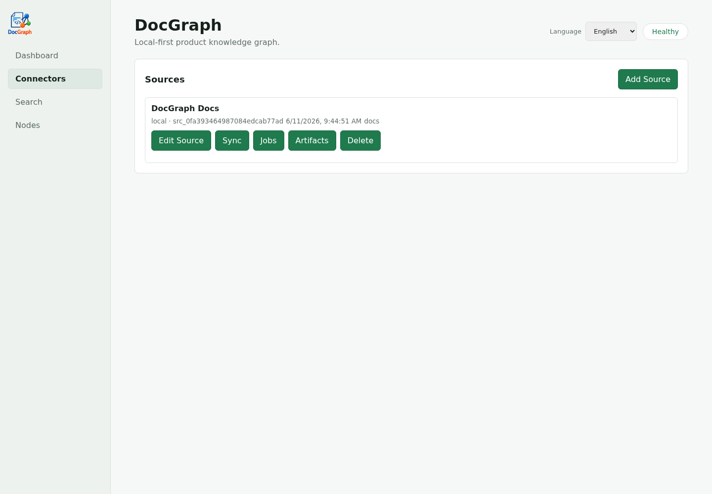
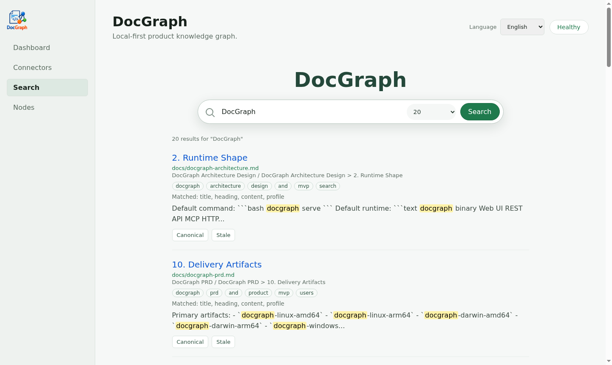

# DocGraph

English | [中文](README.zh-CN.md)

DocGraph is a local-first document knowledge graph for teams, internal knowledge bases, and local AI agents. It indexes local documents, Git repository docs, HTML sites, Confluence pages, OpenAPI specs, SFTP directories, and web documentation into local SQLite, then exposes the result through an embedded Web UI, REST API, and MCP tools.

The goal is to keep document search, context assembly, and impact analysis close to your machine or intranet, without syncing internal knowledge into an external SaaS service.

## Screenshots

Dashboard shows source, document, section, node, edge, and sync-job counts for the local knowledge base.



Connectors let you add, edit, sync, and inspect documentation sources.



Search provides local retrieval across document sections and generated retrieval profiles.



## Features

- Single Go binary with an embedded Web UI.
- Local SQLite + FTS5 storage, no external database required.
- Connectors for `local`, `git`, `static`, `html`, `sftp`, `confluence`, `openapi`, and `webdocs` sources.
- MCP tools: `doc_search`, `doc_context`, `doc_get_node`, `doc_get_section`, `doc_related`, and `doc_impact`.
- Document-backed knowledge graph with nodes, edges, provenance, sync history, and feedback markers.
- Chinese-aware retrieval profile generation for mixed Chinese/English internal docs.
- Optional token authentication for Web/API/SSE endpoints.

## How It Works

DocGraph turns existing documentation into a local, queryable knowledge layer:

1. Connect sources: add local directories, Git repositories, static HTML, Confluence pages, OpenAPI files, SFTP folders, or web documentation centers.
2. Normalize documents: each connector converts source content into a common document and section model.
3. Index locally: documents, sections, retrieval profiles, nodes, edges, aliases, and sync jobs are stored in SQLite with FTS5 search.
4. Build relationships: DocGraph derives product/module/document/section/API nodes and connects them with evidence-backed edges.
5. Query with evidence: users and agents search sections, assemble task context, inspect related nodes, and run impact analysis through the Web UI, REST API, or MCP.

All data stays in the configured local data directory unless you explicitly expose the server or move the database.

## Quick Start

```bash
go build -buildvcs=false -o bin/docgraph ./cmd/docgraph
./bin/docgraph init --data ./.docgraph
./bin/docgraph serve --data ./.docgraph --host 127.0.0.1 --port 8787
```

Open `http://127.0.0.1:8787`, then add and sync documentation sources from the Web UI.

You can also add a local documentation source from the CLI:

```bash
./bin/docgraph source add --data ./.docgraph --name "Docs" --dsn /path/to/docs
./bin/docgraph source sync --data ./.docgraph --id src_xxx
./bin/docgraph search --data ./.docgraph "authentication failure"
./bin/docgraph context --data ./.docgraph --max-sections 5 "Debug authentication failure"
```

## Development

```bash
make test
make build
make build-release
make run
```

`make test` runs `go test -buildvcs=false ./...`. The Makefile keeps Go build caches inside `.gocache/` and `.gomodcache/`, both ignored by Git.

## Release Builds

The repository includes a GitHub Actions workflow at `.github/workflows/release.yml`.

- Manual `release` workflow runs build and uploads artifacts.
- Pushing a `v*` tag runs tests, builds binaries, and creates a GitHub Release.
- Build artifacts cover `linux/windows/darwin` on `amd64/arm64`.
- Release artifacts include platform archives and SHA-256 checksum files.
- To rebuild an existing release manually, run the `release` workflow and set `release_tag` to the tag name, such as `v0.1.0`.

Example:

```bash
git tag v0.1.0
git push origin v0.1.0
```

## MCP

DocGraph supports stdio MCP:

```bash
./bin/docgraph mcp --data ./.docgraph
```

HTTP/SSE MCP setup is documented in [docs/mcp-setup.md](docs/mcp-setup.md).

## Runtime Dependencies

DocGraph itself is a single Go binary. Some connectors require local tools at runtime:

- Git sources require a local `git` executable.
- SPA web crawling requires Chrome, Chromium, Edge, or `ROD_BROWSER_BIN` pointing to a browser executable.

## Documentation

- [Product requirements](docs/docgraph-prd.md)
- [Architecture](docs/docgraph-architecture.md)
- [MCP setup](docs/mcp-setup.md)
- [Acceptance checklist](docs/docgraph-acceptance.md)

## Security Notes

- Do not commit real tokens, cookies, private keys, internal domains, local databases, or indexed document data.
- For team or shared deployments, use `auth.mode: token`.
- `.docgraph/`, `.docgraph-test/`, `.gocache/`, `.gomodcache/`, and `bin/` are ignored.

## License

DocGraph is licensed under the [Server Side Public License v1.0](LICENSE).

Internal company use, internal deployment, and internal modification are allowed. If you make DocGraph or a modified version available to third parties as a hosted service, you must comply with SSPL section 13 by making the corresponding Service Source Code available, or obtain a separate commercial license.
